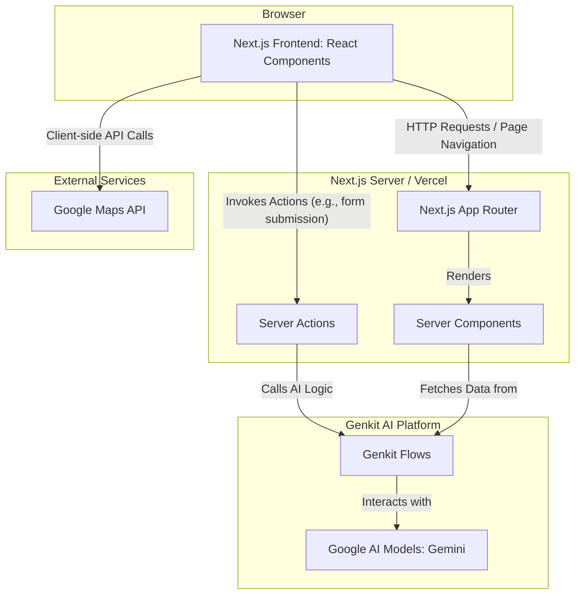

# Explorica Application Architecture

This document provides a detailed overview of the technical architecture for the Explorica web application.

## High-Level Overview

Explorica is a modern web application built on Next.js, leveraging server components and serverless functions for a performant and scalable user experience. It integrates a powerful AI backend using Genkit to provide intelligent travel planning features.

## 1. Frontend (Client-Side)

The frontend is what the user sees and interacts with in their browser.

-   **Framework**: **Next.js 14+** using the **App Router**. This provides file-system based routing, optimized performance, and support for React Server Components.
-   **Language**: **TypeScript**. For type safety and improved developer experience.
-   **UI Library**: **React**. Components are built as reusable, modular pieces.
-   **Component Library**: **ShadCN/UI**. A collection of beautifully designed and accessible components (like Buttons, Cards, Forms) that are highly customizable. These live in `src/components/ui`.
-   **Styling**:
    -   **Tailwind CSS**: A utility-first CSS framework for rapid UI development. Configuration is in `tailwind.config.ts`.
    -   **`globals.css`**: Defines the application's theme (colors, fonts) using CSS custom properties, making it easy to maintain a consistent look and feel.
-   **Key Components & Pages**:
    -   `src/app/layout.tsx`: The root layout of the application, including the main HTML structure, Header, and Footer.
    -   `src/app/page.tsx`: The landing page, composed of sections like `Hero`, `HighlightedDestinations`, and `SearchBar`.
    -   `src/app/destinations/page.tsx`: Displays a filterable list of travel destinations.
    -   `src/app/smart-planner/page.tsx`: Contains the `SmartPlannerForm` which allows users to interact with the AI itinerary generator.
    -   `src/components/chatbot/Chatbot.tsx`: A floating chat widget that provides real-time assistance using the AI Travel Buddy.
    -   `src/components/maps/HeatMap.tsx`: An interactive component that uses `@vis.gl/react-google-maps` to display environmental data.

## 2. Backend (Server-Side)

The backend logic runs on the server, handled by Next.js and serverless functions.

-   **Runtime**: **Node.js**.
-   **Server-Side Logic**:
    -   **React Server Components (RSC)**: Many components are rendered on the server by default (`src/app/**/page.tsx`). This reduces the amount of JavaScript sent to the client, improving initial load times.
    -   **Server Actions**: Asynchronous functions that run on the server, triggered by form submissions or client-side calls. These are used to securely interact with the AI backend without exposing sensitive logic. All server actions are defined in `src/lib/actions.ts`.
        -   `generateItineraryAction`: Takes user input from the Smart Planner form and calls the AI flow.
        -   `sendMessageToTravelBuddyAction`: Handles messages sent to the chatbot.

## 3. AI Integration (Genkit)

All AI-powered features are managed through Genkit, a framework for building production-ready AI applications.

-   **Framework**: **Genkit**.
-   **Configuration**: The global Genkit instance and model configuration are defined in `src/ai/genkit.ts`. It's configured to use Google AI's Gemini models.
-   **Flows (`src/ai/flows/*.ts`)**:
    -   A "flow" is a server-side function that orchestrates calls to AI models, defines structured inputs/outputs, and contains the core prompt engineering. Each flow is defined in its own file and marked with `'use server';`.
    -   **`generate-trip-itinerary.ts`**: Contains the logic and prompt for creating a personalized travel itinerary. It uses Zod schemas to define the expected input (`duration`, `budget`) and the structured output (`itinerary`).
    -   **`travel-buddy-flow.ts`**: Powers the chatbot. It takes conversation history and a new message as input and generates a helpful response.
    -   **`get-sustainability-tips.ts`**: Provides eco-friendly travel tips based on trip details.
-   **Model**: **Google Gemini 2.5 Flash**. A powerful and fast multimodal language model used for text generation, conversation, and understanding user intent.

## 4. Data Flow Example: Smart Planner

Here’s how the components work together when a user generates an itinerary:

1.  **User Interaction**: The user fills out the form in `SmartPlannerForm.tsx` and clicks "Generate Plan".
2.  **Form Submission**: The form submission triggers the `generateItineraryAction` Server Action defined in `src/lib/actions.ts`.
3.  **Server Action**: `generateItineraryAction` validates the user's input using a Zod schema.
4.  **Call AI Flow**: The action then calls the `generateTripItinerary` function from `src/ai/flows/generate-trip-itinerary.ts`.
5.  **Genkit Flow**:
    -   The `generateTripItineraryFlow` is executed.
    -   It formats the user's input into a detailed prompt for the AI.
    -   It sends the prompt to the **Google Gemini model** via the Genkit Google AI plugin.
6.  **AI Response**: The Gemini model returns a structured JSON object containing the generated itinerary as a Markdown string.
7.  **Return Data**: The flow returns this data to the Server Action, which in turn passes it back to the `SmartPlannerForm.tsx` component as state.
8.  **Render Output**: The component re-renders, displaying the formatted itinerary to the user using the `react-markdown` library.
